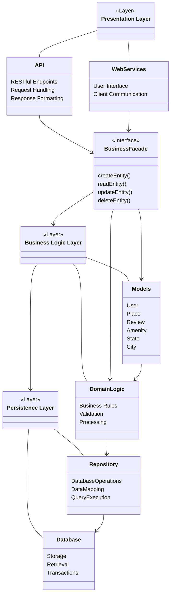

### Layer Descriptions

1. **Presentation Layer** (Top)
   - Handles all user interactions and API endpoints
   - Manages request/response formatting
   - Provides web services and user interface

2. **Business Logic Layer** (Middle)
   - Contains the core business logic and domain models
   - Implements the Facade pattern through BusinessFacade
   - Manages entities like User, Place, Review, and Amenity

3. **Persistence Layer** (Bottom)
   - Responsible for data storage and retrieval
   - Handles database operations and transactions
   - Manages data mapping and query execution

### Communication via Facade Pattern

The BusinessFacade serves as a unified interface that:
- Simplifies the interaction between layers
- Provides a clean API for the presentation layer
- Encapsulates the complexity of business operations
- Manages the communication with the persistence layer