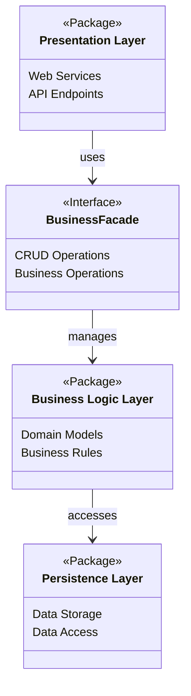

# High-Level Package Diagram

## Overview

This document presents the high-level architecture of the HBnB Evolution application, showing the three main layers and how they communicate through the Facade pattern.

## Architecture Diagram

## Layer Descriptions

1. **Presentation Layer**
   - Handles user interactions and API endpoints
   - Manages request/response formatting

2. **Business Logic Layer**
   - Contains core business logic and models
   - Implements business rules and validations

3. **Persistence Layer**
   - Manages data storage and retrieval
   - Handles database operations

## Communication Flow

The BusinessFacade pattern simplifies the interaction between layers by providing a unified interface for the presentation layer to access business operations.