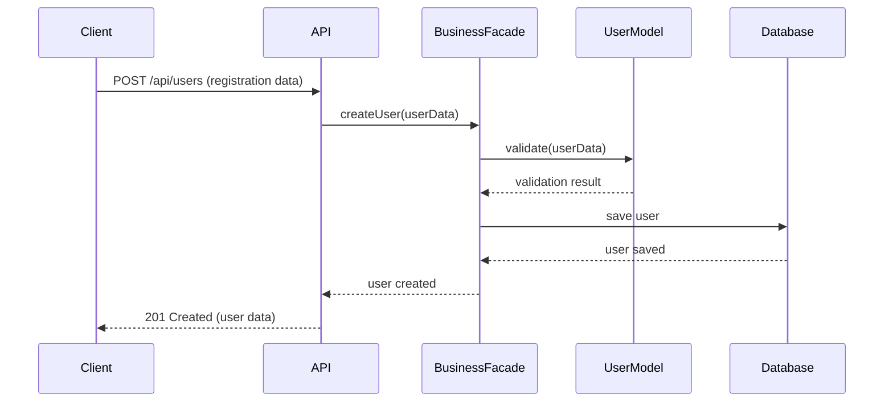
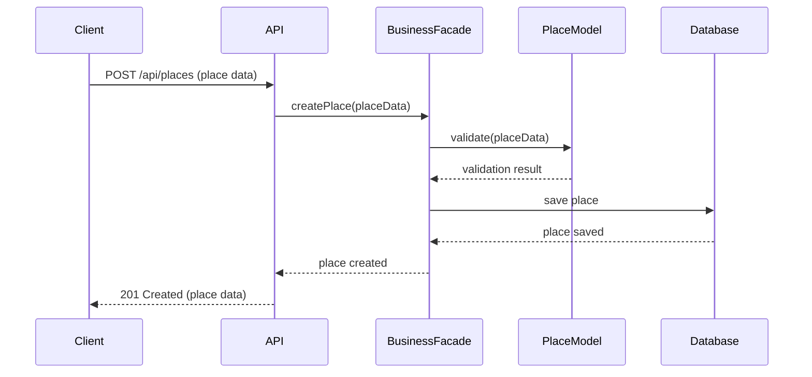
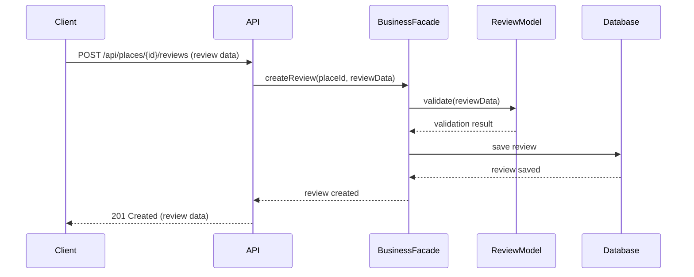
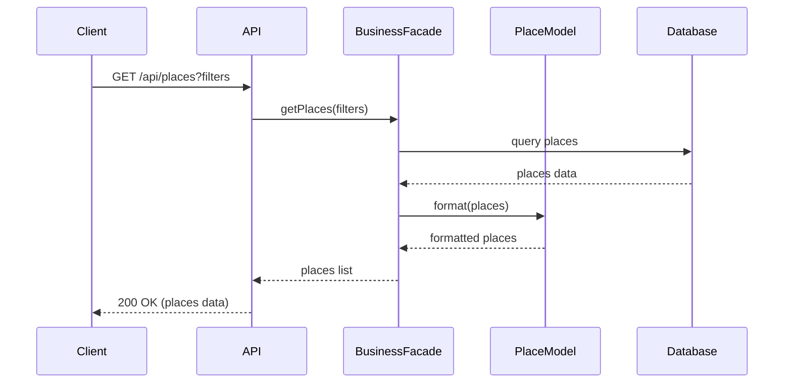

# API Sequence Diagrams

## User Registration Flow

```mermaid
sequenceDiagram
    participant Client
    participant API
    participant BusinessFacade
    participant UserModel
    participant Database

    Client->>API: POST /api/users (registration data)
    API->>BusinessFacade: createUser(userData)
    BusinessFacade->>UserModel: validate(userData)
    UserModel-->>BusinessFacade: validation result
    BusinessFacade->>Database: save user
    Database-->>BusinessFacade: user saved
    BusinessFacade-->>API: user created
    API-->>Client: 201 Created (user data)
```

## Place Creation Flow

```mermaid
sequenceDiagram
    participant Client
    participant API
    participant BusinessFacade
    participant PlaceModel
    participant Database

    Client->>API: POST /api/places (place data)
    API->>BusinessFacade: createPlace(placeData)
    BusinessFacade->>PlaceModel: validate(placeData)
    PlaceModel-->>BusinessFacade: validation result
    BusinessFacade->>Database: save place
    Database-->>BusinessFacade: place saved
    BusinessFacade-->>API: place created
    API-->>Client: 201 Created (place data)
```

## Review Submission Flow

```mermaid
sequenceDiagram
    participant Client
    participant API
    participant BusinessFacade
    participant ReviewModel
    participant Database

    Client->>API: POST /api/places/{id}/reviews (review data)
    API->>BusinessFacade: createReview(placeId, reviewData)
    BusinessFacade->>ReviewModel: validate(reviewData)
    ReviewModel-->>BusinessFacade: validation result
    BusinessFacade->>Database: save review
    Database-->>BusinessFacade: review saved
    BusinessFacade-->>API: review created
    API-->>Client: 201 Created (review data)
```

## Place Listing Retrieval Flow

```mermaid
sequenceDiagram
    participant Client
    participant API
    participant BusinessFacade
    participant PlaceModel
    participant Database

    Client->>API: GET /api/places?filters
    API->>BusinessFacade: getPlaces(filters)
    BusinessFacade->>Database: query places
    Database-->>BusinessFacade: places data
    BusinessFacade->>PlaceModel: format(places)
    PlaceModel-->>BusinessFacade: formatted places
    BusinessFacade-->>API: places list
    API-->>Client: 200 OK (places data)
```