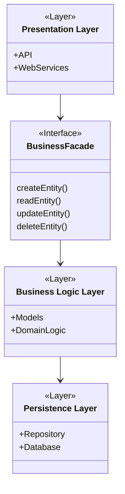
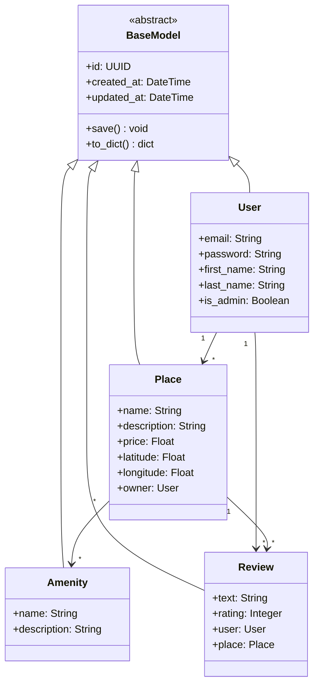
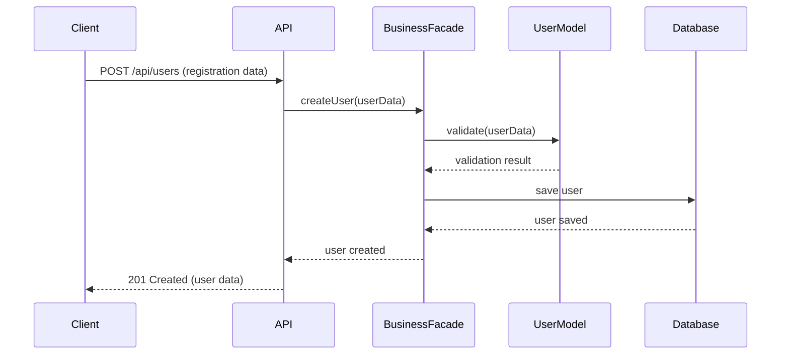
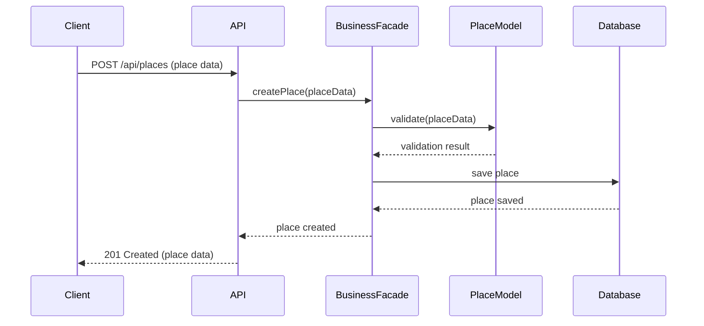

# HBnB Evolution - Technical Documentation

## 1. Introduction

This document provides comprehensive technical documentation for the HBnB Evolution project, a simplified version of an AirBnB-like application. The documentation covers the system's architecture, design patterns, and key interactions between components.

## 2. System Architecture

### 2.1 Overview

The application follows a three-layer architecture pattern with clear separation of concerns:

### 2.2 Layer Responsibilities

1. **Presentation Layer**
   - Handles HTTP requests/responses
   - Manages API endpoints
   - Implements input validation
   - Formats responses

2. **Business Logic Layer**
   - Contains core business rules
   - Manages entity relationships
   - Implements validation logic
   - Coordinates operations

3. **Persistence Layer**
   - Handles data storage
   - Manages transactions
   - Implements data access
   - Ensures data integrity

## 3. Business Logic Layer Design

The Business Logic Layer contains the following key entities and their relationships:

## 4. API Interactions

### 4.1 User Registration Flow

### 4.2 Place Creation Flow

## 5. Implementation Guidelines

### 5.1 Design Patterns

1. **Facade Pattern**
   - Used to simplify the interface between layers
   - Implemented through BusinessFacade class
   - Reduces coupling between components

2. **Repository Pattern**
   - Used in the Persistence Layer
   - Abstracts data access logic
   - Enables easier testing and maintenance

### 5.2 Best Practices

1. **Input Validation**
   - Validate all input at API level
   - Perform business validation in models
   - Use type hints and schemas

2. **Error Handling**
   - Use appropriate HTTP status codes
   - Provide meaningful error messages
   - Implement proper logging

3. **Security**
   - Implement authentication/authorization
   - Hash passwords securely
   - Validate user permissions

## 6. Conclusion

This technical documentation provides a comprehensive guide for implementing the HBnB Evolution application. It covers the system's architecture, component interactions, and implementation guidelines. Developers should refer to this document throughout the development process to ensure consistency and adherence to the design principles.