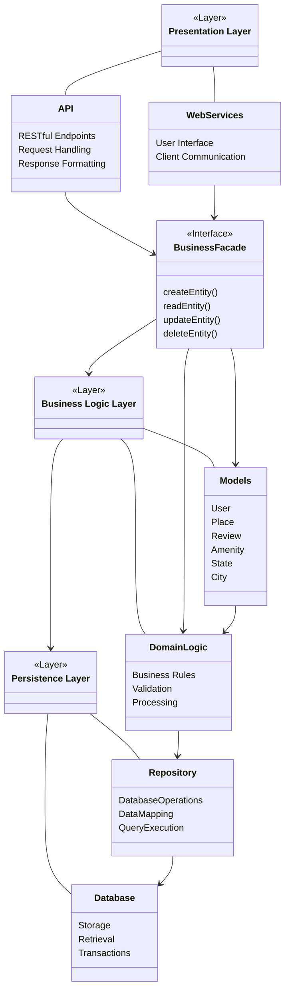
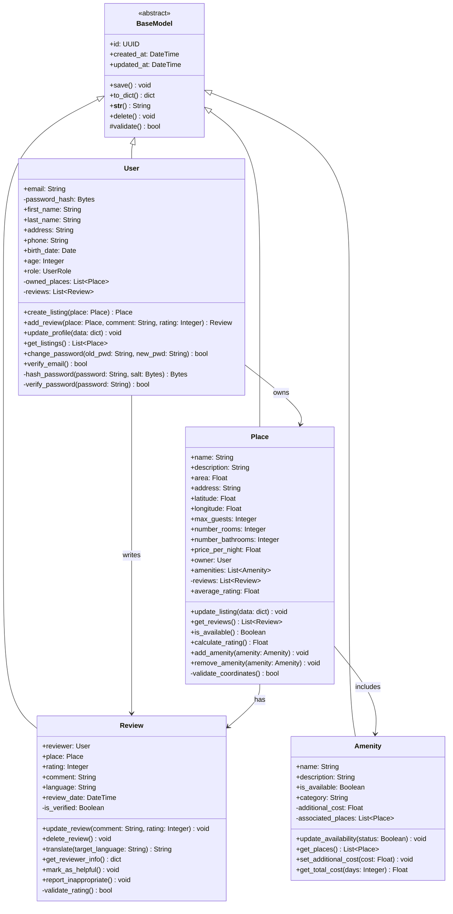
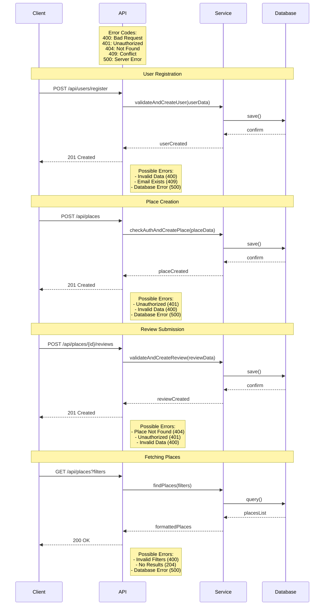

# HBnB Technical Documentation

## Introduction

### Purpose
This technical document serves as a comprehensive blueprint for the HBnB (Holberton BnB) project. It consolidates all architectural diagrams, design decisions, and implementation guidelines into a single, cohesive reference document that will guide the development process.

### Project Overview
HBnB is a web application inspired by AirBnB, designed to facilitate property rentals and bookings. The system implements a robust three-tier architecture, utilizing modern design patterns and best practices to ensure scalability, maintainability, and security.

## 1. High-Level Architecture

### Package Diagram


### Architectural Design Decisions

1. **Three-Tier Architecture**
   - **Presentation Layer**: Handles user interface and API endpoints
   - **Business Logic Layer**: Contains core business rules and data processing
   - **Persistence Layer**: Manages data storage and retrieval

2. **Facade Pattern Implementation**
   - Simplifies complex subsystem interactions
   - Provides a unified interface for the presentation layer
   - Reduces coupling between layers
   - Facilitates maintenance and future modifications

## 2. Business Logic Layer

### Class Diagram


### Domain Model Design Decisions

1. **BaseModel Abstraction**
   - Provides common functionality for all entities
   - Implements UUID-based identification
   - Manages creation and update timestamps
   - Ensures consistent data validation

2. **Entity Relationships**
   - User-Place: One-to-many ownership relationship
   - User-Review: One-to-many authorship relationship
   - Place-Review: One-to-many composition
   - Place-Amenity: Many-to-many association

## 3. API Interaction Flows

### Error Handling Strategy
The system implements a comprehensive error handling strategy with standardized HTTP status codes:

- **400 Bad Request**: Invalid input data or parameters
- **401 Unauthorized**: Authentication required
- **404 Not Found**: Resource not found
- **409 Conflict**: Resource conflict (e.g., duplicate email)
- **500 Server Error**: Internal server errors

### Sequence Diagrams



#### Flow Descriptions

## Implementation Guidelines

### Error Handling Implementation
1. **Validation Layer**
   - Input validation at API level
   - Business rule validation in service layer
   - Data integrity checks in model layer

2. **Error Response Format**
   ```json
   {
     "status": "error",
     "code": 400,
     "message": "Invalid input",
     "details": {
       "field": "email",
       "error": "Invalid email format"
     }
   }
   ```

3. **Error Logging**
   - Log all errors with appropriate severity levels
   - Include stack traces for 500 errors
   - Monitor error patterns for system health

### Security Considerations
1. **Authentication**
   - Implement JWT-based authentication
   - Secure password hashing using bcrypt
   - Session management and token expiration

2. **Data Protection**
   - Input sanitization
   - CORS configuration
   - Rate limiting for API endpoints

### Performance Optimization
1. **Database**
   - Implement indexing for frequent queries
   - Use connection pooling
   - Optimize query patterns

2. **Caching**
   - Implement Redis for session storage
   - Cache frequently accessed data
   - Use ETags for API responses

### Code Organization
1. **Project Structure**
   ```
   hbnb/
   ├── api/                 # API endpoints
   ├── models/             # Data models
   ├── services/           # Business logic
   ├── static/             # Static files
   ├── templates/          # HTML templates
   ├── tests/              # Test files
   ├── config.py           # Configuration
   └── requirements.txt    # Dependencies
   ```

2. **Coding Standards**
   - Follow PEP 8 for Python code
   - Use ESLint for JavaScript
   - Write comprehensive documentation
   - Implement unit tests

## Conclusion
This technical documentation provides a comprehensive blueprint for implementing the HBnB project. The updated error handling strategy ensures robust and consistent error management across all system components, while maintaining the original architectural patterns and design decisions.