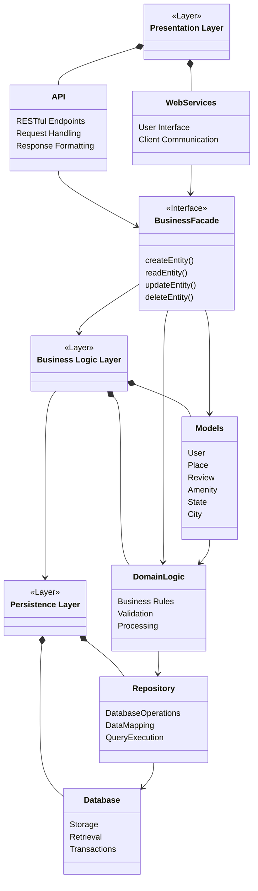
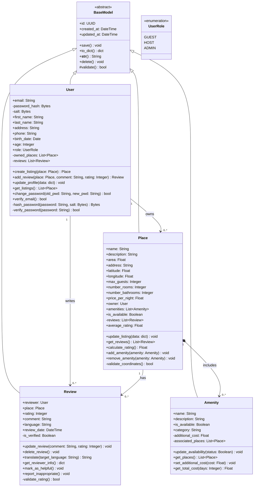
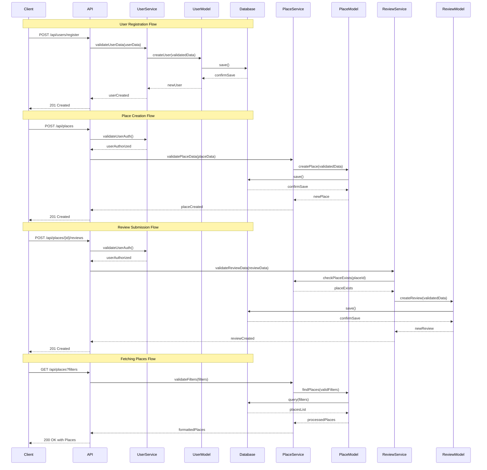

# HBnB Technical Documentation

## Introduction

This technical document serves as a comprehensive blueprint for the HBnB (Holberton BnB) project, a web application designed to facilitate property rentals and bookings. This document outlines the system's architecture, component interactions, and implementation guidelines through detailed diagrams and explanations.

### Purpose and Scope
- Provide a clear architectural overview of the HBnB system
- Document the system's components and their interactions
- Guide the implementation process
- Serve as a reference for developers and stakeholders

## 1. High-Level Architecture

### Package Diagram

### Architecture Overview
The system follows a three-layer architecture pattern with a Facade interface:

1. **Presentation Layer**
   - Handles user interactions and API endpoints
   - Manages request/response formatting
   - Contains RESTful API and web services

2. **Business Logic Layer**
   - Implements core business logic through the Facade pattern
   - Manages domain models and business rules
   - Handles data validation and processing

3. **Persistence Layer**
   - Manages data storage and retrieval
   - Handles database operations and transactions
   - Provides data mapping services

## 2. Business Logic Layer Details

### Class Diagram

### Key Components
1. **BaseModel**
   - Abstract base class providing common functionality
   - Handles creation and update timestamps
   - Implements basic CRUD operations

2. **Domain Models**
   - User: Manages user accounts and authentication
   - Place: Handles property listings and amenities
   - Review: Manages property reviews and ratings
   - Amenity: Represents property features and services

## 3. API Interaction Flows

### Sequence Diagrams

### API Flow Descriptions

1. **User Registration**
   - Validates user input data
   - Creates new user record
   - Returns confirmation with user details
   - Implements proper error handling

2. **Place Creation**
   - Authenticates user
   - Validates place data
   - Creates new place listing
   - Associates place with owner

3. **Review Submission**
   - Verifies user authentication
   - Validates review data
   - Checks place existence
   - Creates and associates review

4. **Fetching Places**
   - Processes filter parameters
   - Queries database with filters
   - Returns formatted place listings
   - Implements pagination

## Implementation Guidelines

1. **Security Considerations**
   - Implement proper authentication and authorization
   - Use secure password hashing
   - Validate all user inputs
   - Implement rate limiting

2. **Performance Optimization**
   - Use database indexing
   - Implement caching where appropriate
   - Optimize database queries
   - Use pagination for large datasets

3. **Error Handling**
   - Implement comprehensive error handling
   - Use appropriate HTTP status codes
   - Provide meaningful error messages
   - Log errors for debugging

4. **Code Organization**
   - Follow clean code principles
   - Implement proper separation of concerns
   - Use meaningful naming conventions
   - Write comprehensive documentation

## Conclusion

This technical documentation provides a comprehensive overview of the HBnB system architecture and implementation guidelines. It serves as a reference for developers and stakeholders throughout the development process. Regular updates and maintenance of this documentation will ensure its continued relevance and usefulness.

