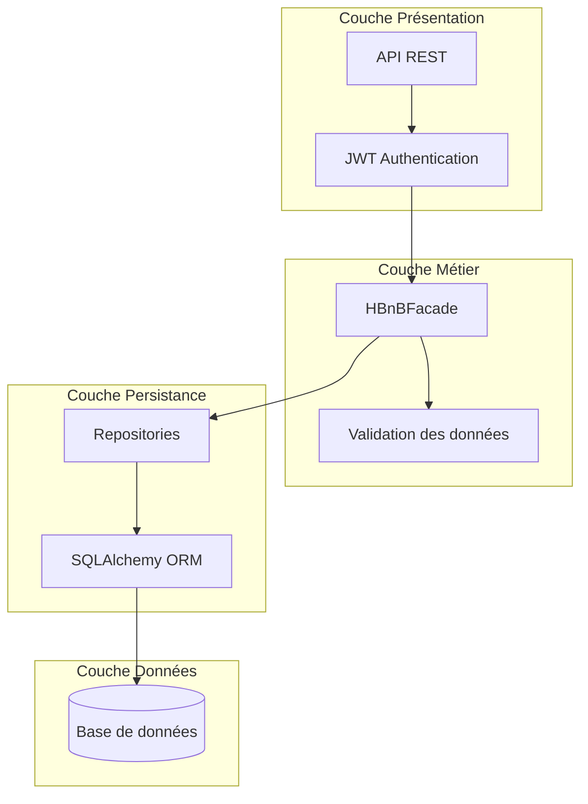
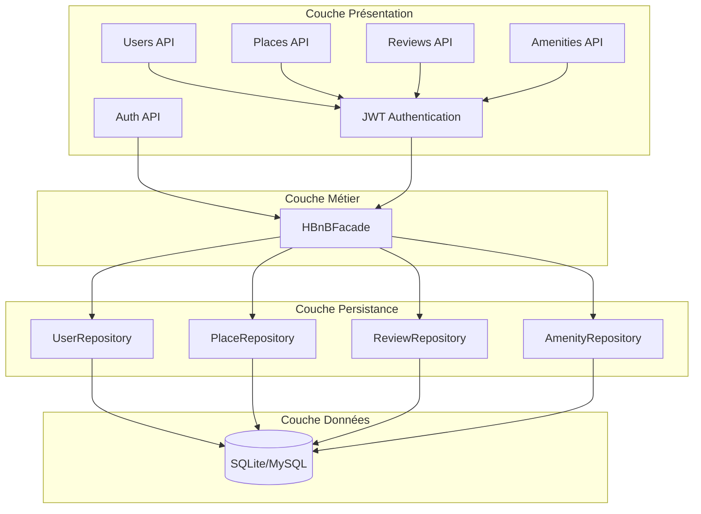
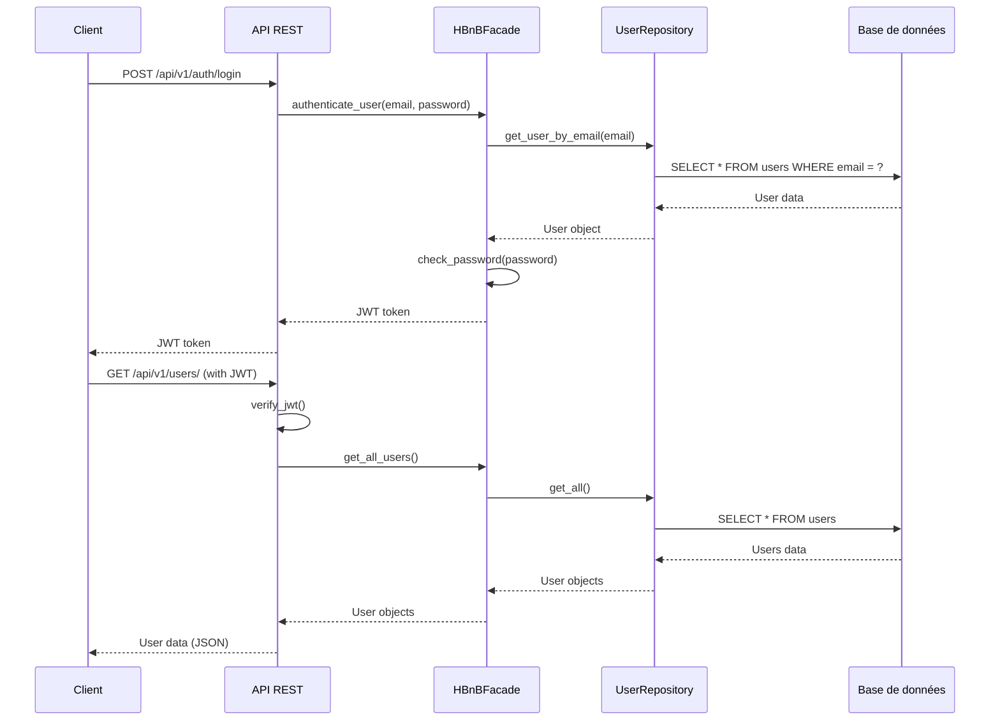
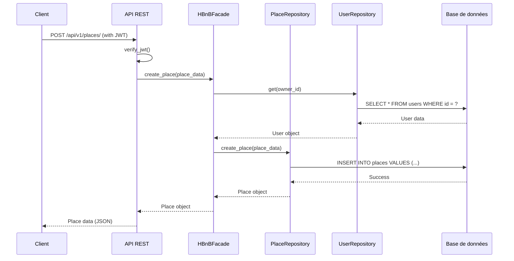

# Diagramme d'Architecture pour HBnB

Ce diagramme représente l'architecture globale de l'application HBnB, montrant les différentes couches et leurs interactions.

## Architecture en couches

## Architecture détaillée

## Flux d'authentification

## Flux de création d'un lieu

