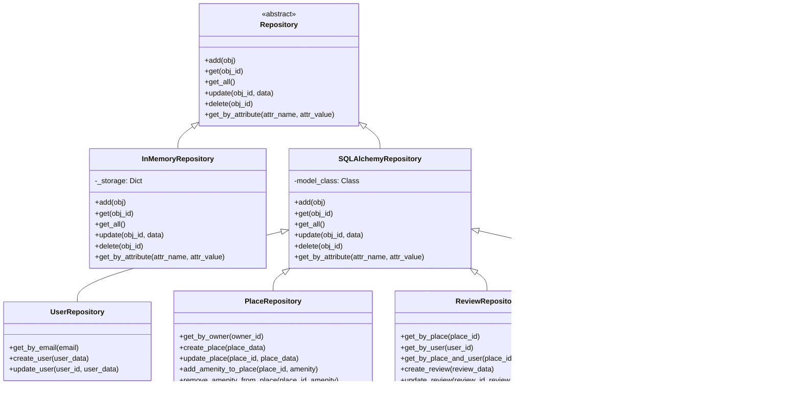

# Class Diagram for SQLAlchemy Models

This diagram represents the Python classes used in the HBnB project, showing how SQLAlchemy models are structured and related.

## Complete Class Diagram

## Explanation of Relationships

1. **Inheritance**:
   - All model classes (User, Place, Review, Amenity) inherit from BaseModel
   - BaseModel provides common attributes and methods like id, created_at, updated_at, save(), update(), to_dict()

2. **Class Relationships**:
   - User - Place: A user can own multiple places (one-to-many)
   - User - Review: A user can write multiple reviews (one-to-many)
   - Place - Review: A place can have multiple reviews (one-to-many)
   - Place - Amenity: A place can have multiple amenities and an amenity can be associated with multiple places (many-to-many)

## Repository Diagram

## Facade Diagram

