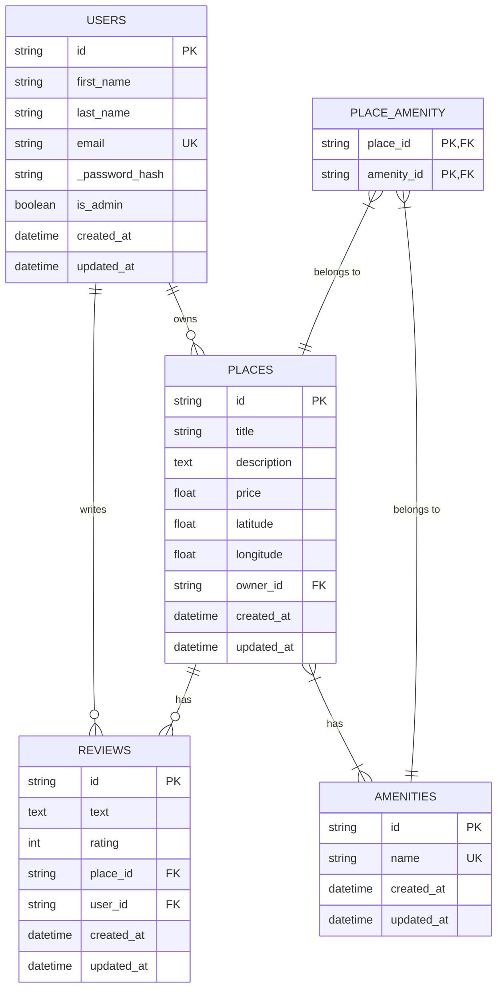
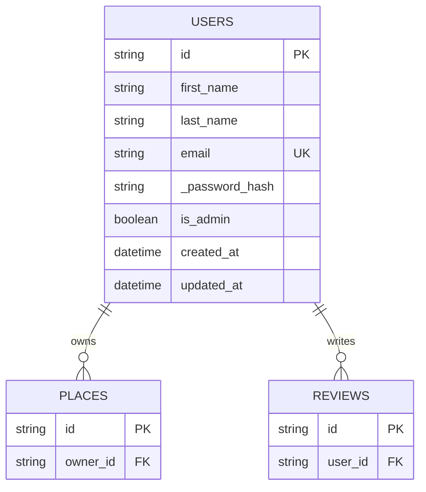
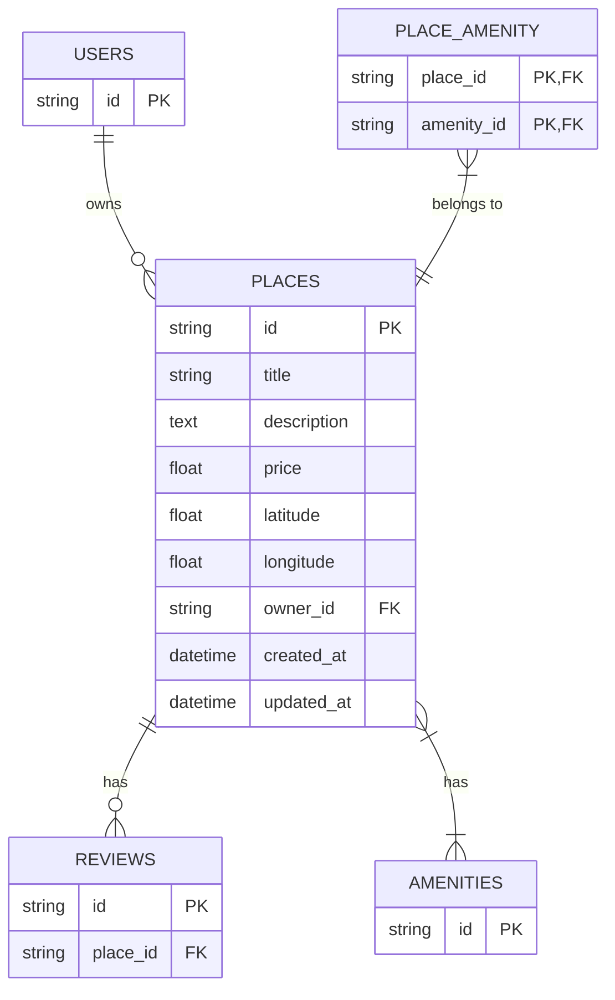
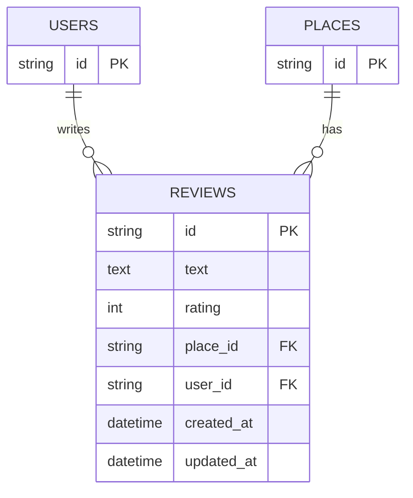
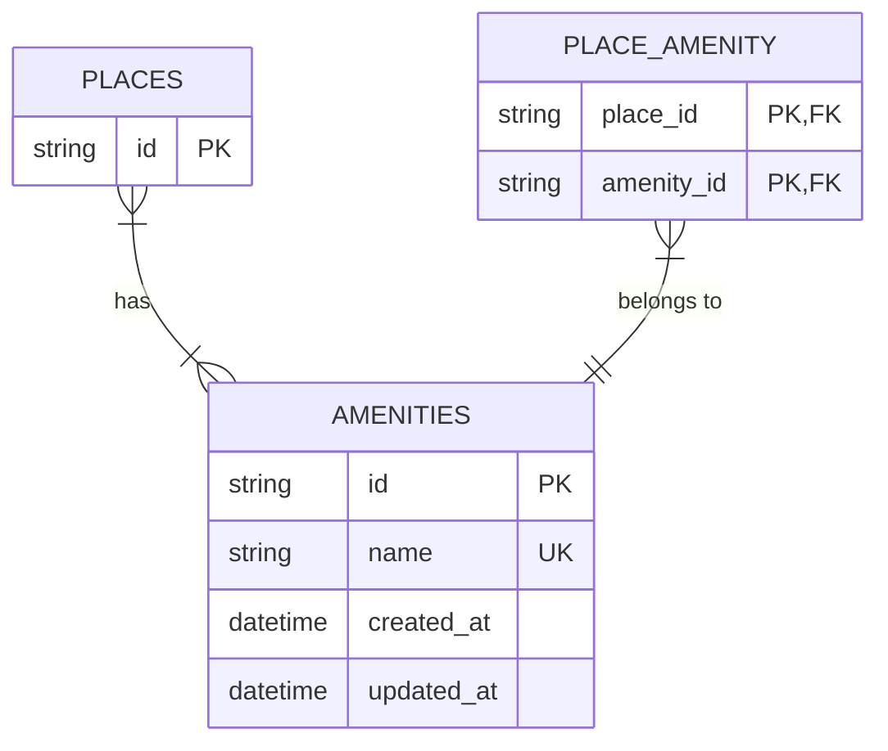

# Entity-Relationship Diagram for HBnB Database

This diagram represents the database structure of the HBnB project, showing the relationships between the different entities.

## Complete ER Diagram

## Explanation of Relationships

1. **Users - Places** (One-to-Many):
   - A user can own multiple places
   - Each place belongs to a single user

2. **Users - Reviews** (One-to-Many):
   - A user can write multiple reviews
   - Each review is written by a single user

3. **Places - Reviews** (One-to-Many):
   - A place can have multiple reviews
   - Each review concerns a single place

4. **Places - Amenities** (Many-to-Many):
   - A place can have multiple amenities
   - An amenity can be associated with multiple places
   - This relationship is implemented through the PLACE_AMENITY association table

## Legend

- PK: Primary Key
- FK: Foreign Key
- UK: Unique Key

## Detailed Diagrams by Entity

### User and its relationships

### Place and its relationships

### Review and its relationships

### Amenity and its relationships

