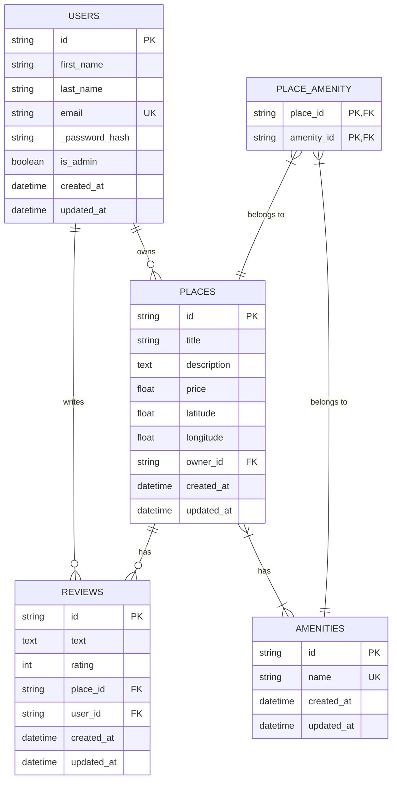
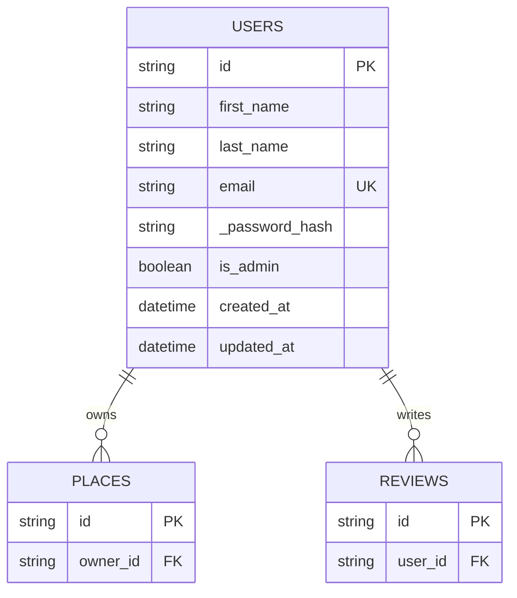
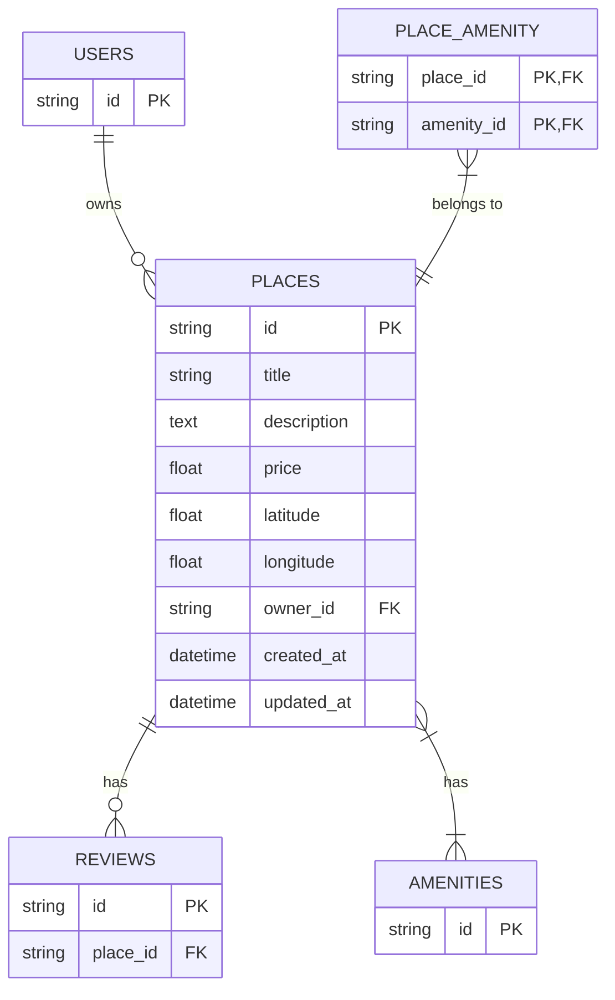
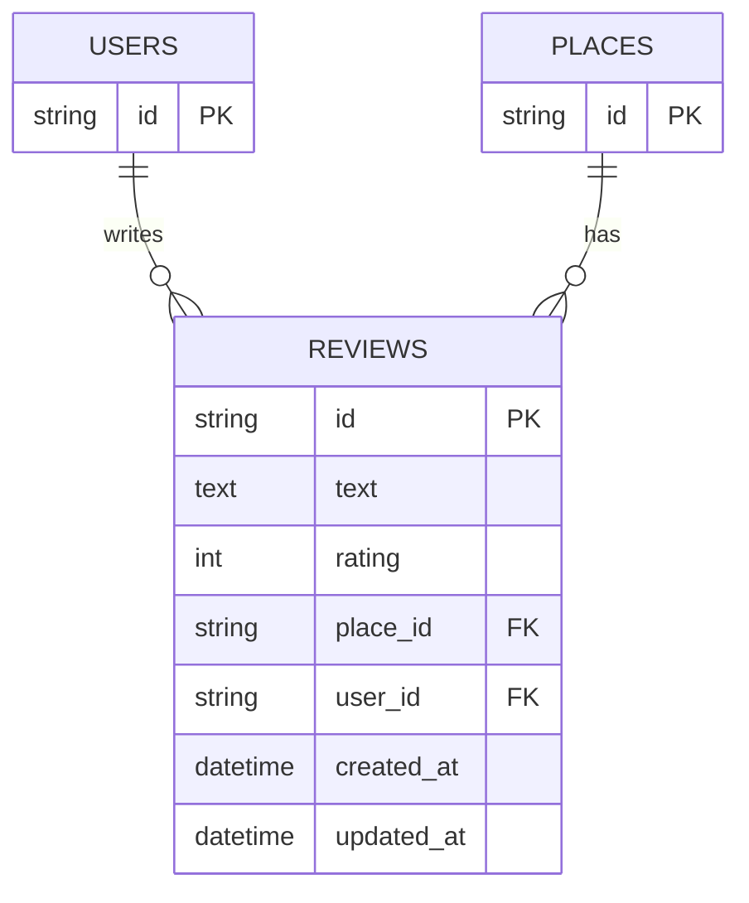
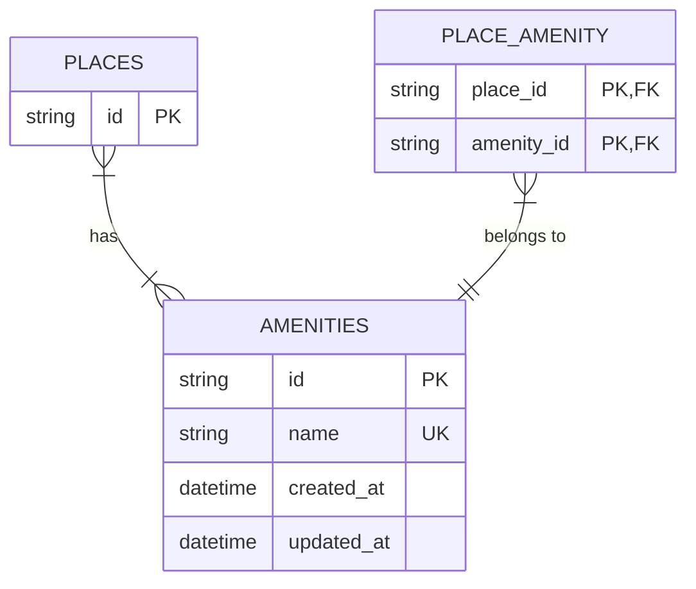

# Entity-Relationship Diagram for HBnB Database

Ce diagramme représente la structure de la base de données du projet HBnB, montrant les relations entre les différentes entités.

## Diagramme ER complet

## Explication des relations

1. **Users - Places** (One-to-Many):
   - Un utilisateur peut posséder plusieurs lieux
   - Chaque lieu appartient à un seul utilisateur

2. **Users - Reviews** (One-to-Many):
   - Un utilisateur peut écrire plusieurs avis
   - Chaque avis est écrit par un seul utilisateur

3. **Places - Reviews** (One-to-Many):
   - Un lieu peut avoir plusieurs avis
   - Chaque avis concerne un seul lieu

4. **Places - Amenities** (Many-to-Many):
   - Un lieu peut avoir plusieurs équipements
   - Un équipement peut être associé à plusieurs lieux
   - Cette relation est implémentée via la table d'association PLACE_AMENITY

## Légende

- PK: Primary Key (Clé primaire)
- FK: Foreign Key (Clé étrangère)
- UK: Unique Key (Clé unique)

## Diagrammes détaillés par entité

### User et ses relations

### Place et ses relations

### Review et ses relations

### Amenity et ses relations

